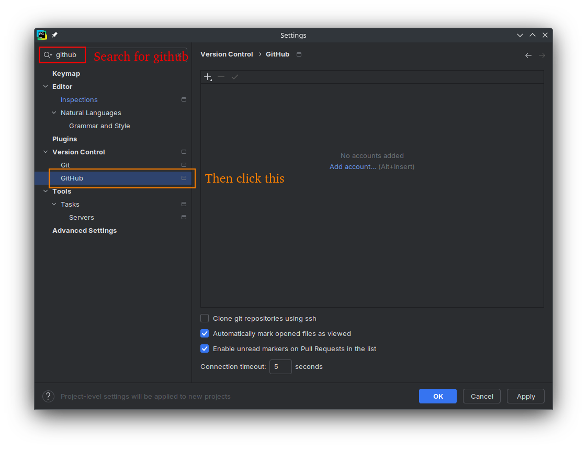
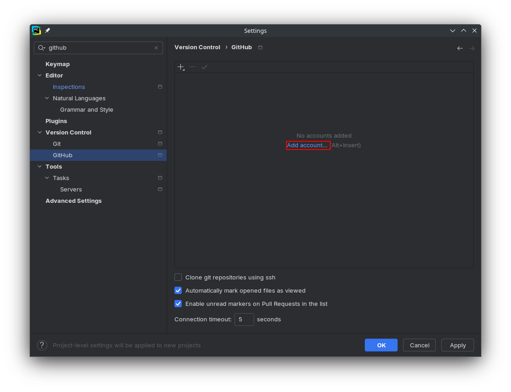
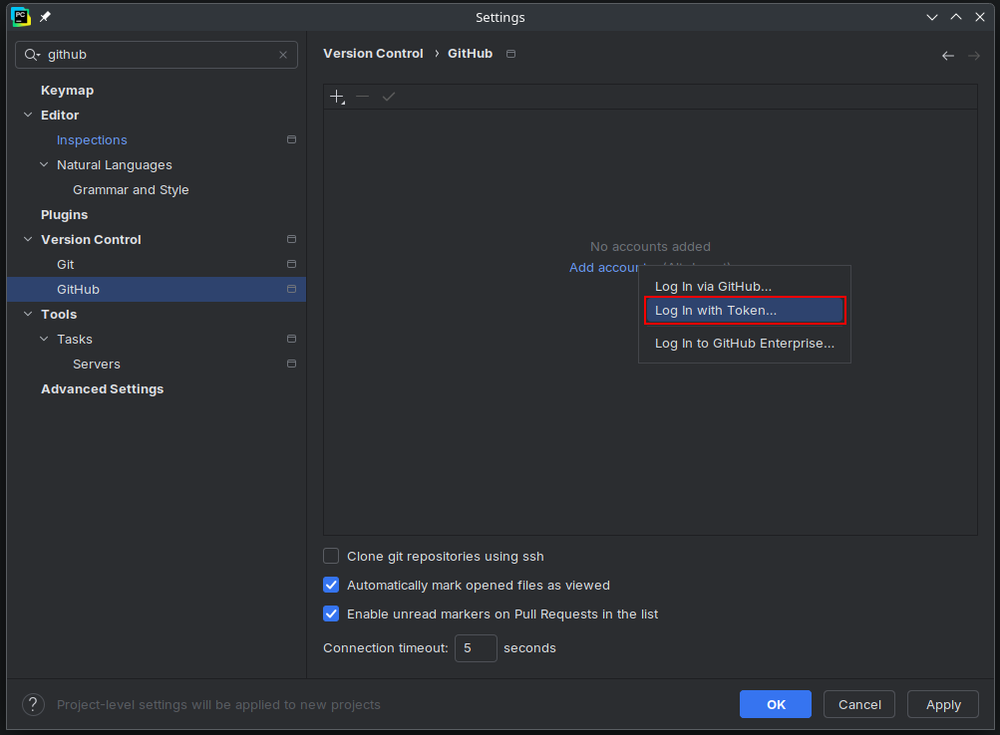
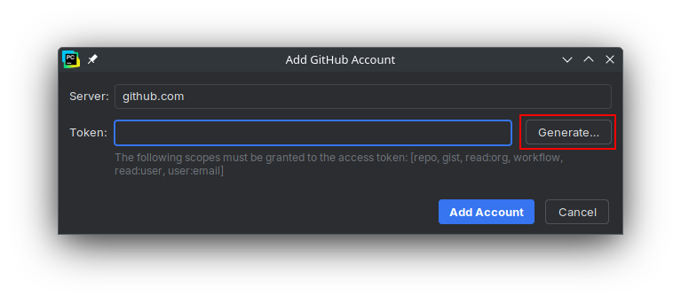
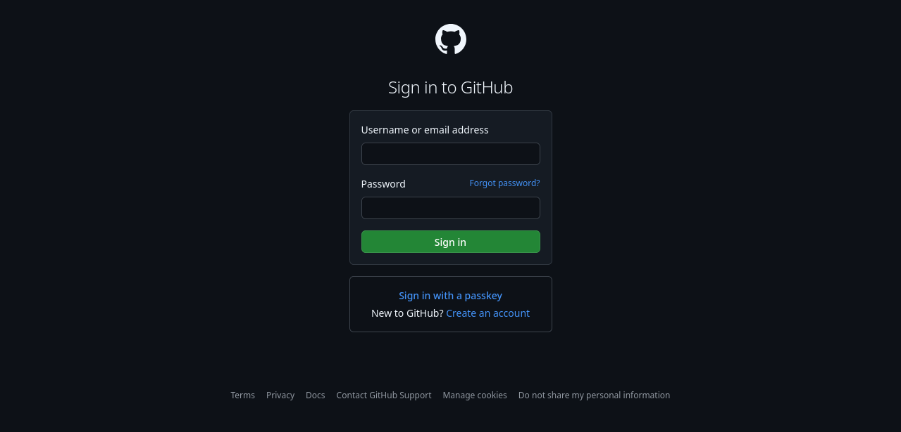
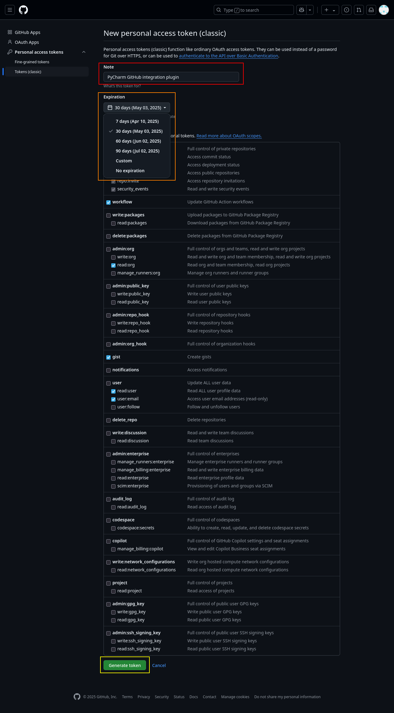
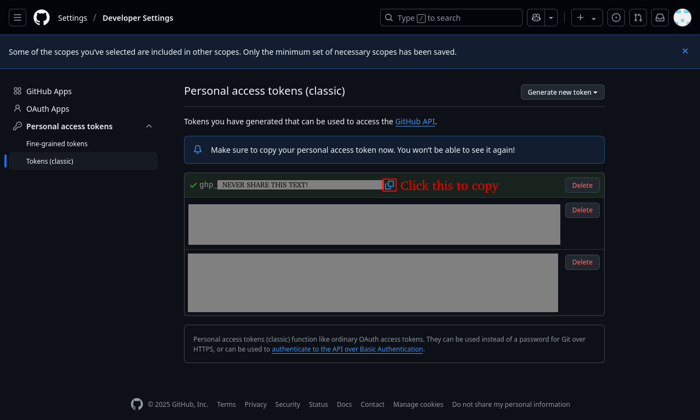
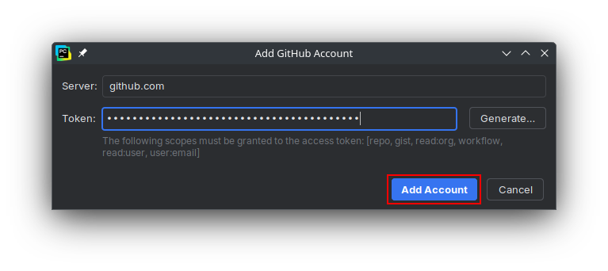
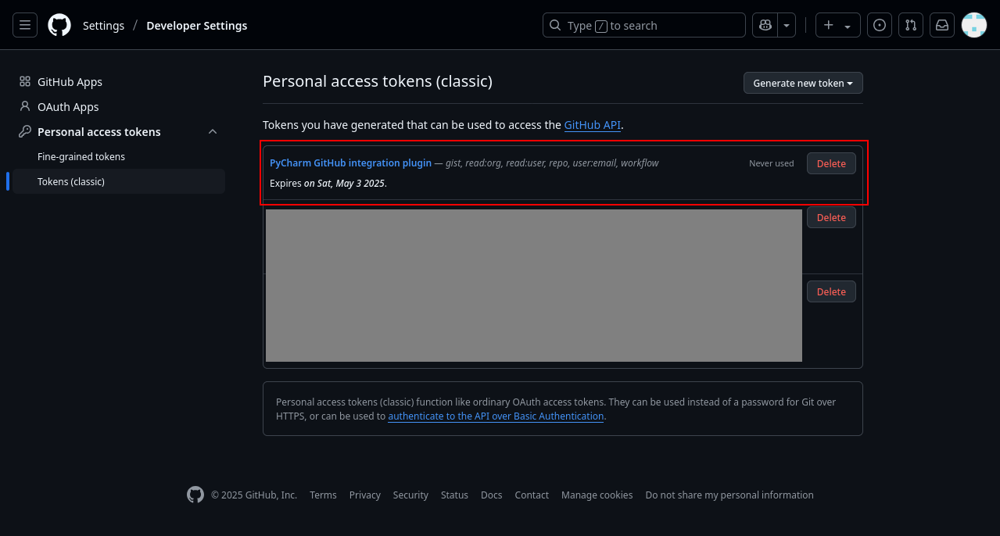

# Configuring PyCharm for COMP1510

This document will cover correctly configuring the IDE for COMP1510. Namely, ensuring that PEP-8 formatting is checked, and adding a GitHub token to enable you to submit code for lab assignments. The steps here will be the same regardless of your operating system. COMP1510 requires PyCharm to be configured in a certain way in order to make the most use of it in lab assignments, and one of the easiest ways to avoid losing marks is to ensure that it is configured properly.

## Opening PyCharm Settings

Do this first, as the next two sections will assume you have already done this.

1. Open PyCharm and click `Customize` from the landing screen.

Then click `All settings...`

2. If you have previously opened a PyCharm project, PyCharm will re-open that project when it launches and will not show the landing screen. In this case, click the gear icon in the window header, and then click `Settings...` from the dropdown.

3. In both cases, this settings panel should appear:

<!-- I can't get screenshots for this because my student license is already activated and I can't activate it a second time. -->
<!-- ## Activating Your Student License

You have 30 days from when you install PyCharm Professional to activate your license. If you attend BCIT or another university or college, you likely already have free access to the premium versions of most Intellij products, including PyCharm. Otherwise, you will have to pay for PyCharm Professional, or you can switch to the free PyCharm Community version which does not require activation.

PyCharm Community lacks some of the more advanced features of PyCharm Professional, but it is still a full-fledged, powerful IDE and is perfectly usable for most software development applications. Most of the steps in this guide are identical in both PyCharm Professional and Community. -->

## Configuring PEP-8 Validation 

PEP-8 is a standard in Python that specifies how code should be formatted. COMP1510 strictly enforces PEP-8 formatting, and any deviation will result in lost marks. Therefore, it is important to ensure that the IDE is configured to check for PEP-8 and warn you when code does not conform to it.

1. In the settings panel, type `pep 8` into the search bar.

2. Click on the `Profile` dropdown, and select `Default IDE`. This ensures that the settings are applied to the entire IDE and is used as the default for all new projects; instead of being applied to only the currently open project.

3. There should only be two visible settings: `PEP 8 coding style violation`, and `PEP 8 naming convention violation`. Ensure both are checked. They may already be checked by default, but if not, check them.

4. Click on `PEP 8 coding style violation`, and set the **Scope** to `In All Scopes`, set the **Severity** to `Warning`, and set the **Highlighting in editor** to `Warning`. 

5. Click on `PEP 8 naming convention violation` and set the same three parameters as specified in the previous step. This step and the previous step will result in a yellow line under any code that does not conform to PEP-8 formatting. When programming, you can hover your mouse over the yellow line to see the specific PEP-8 rule that the code does not conform to, allowing you to fix it.

6. Click `Apply` to save the changes.

## Adding a GitHub Personal Access Token

In COMP1510, you will have weekly graded assignments (called labs) where you submit your work by pushing to a specific GitHub repository. For this, you will need a GitHub account, and to create and add a Personal Access Token to PyCharm to allow it to push code as your account. It is a short text string of random characters that works similarly to am one-time password or the session cookie in a browser. 

1. In the settings panel, type `github` into the search bar.

2. Click `GitHub` in the sidebar.

3. Click `Add account...`.

4. From the dropdown, click `Log In with Token...`

5. In the popup the appears, click `Generate...`.

6. Your browser will open to a GitHub login page. Make sure you sign in with the GitHub account that you plan on using to submit coursework. 

7. Once you sign in, you will be redirected to the page for creating tokens. It should already be prepopulated with a name and the required access settings. The default name will be "PyCharm GitHub integration plugin", which you can change. You may also want to use the expiry date dropdown to set the expiry date to after your COMP1510 class ends, or set it to never expire. You can also adjust the settings for what the token is allowed to access, but for COMP1510's purposes, you shouldn't need to change anything. When you're done configuring the token, scroll to the borrom of the page and click `Generate token`.

8. Copy the new token into your clipboard by clicking the button beside it. 

> **Warning:** The Personal Access Token alone is capable of signing into your account, without even entering your username. Never share it with anyone else, for example, with a classmate over Discord.
>
>Your instructor, GitHub, or anyone else have no reason to ask you to send them a token, and such emails or other communications are most likely scams with the goal of gaining access to your GitHub account.  

9. Minimize the browser and paste the token into the PyCharm popup, then click `Add account...`.

10. You should now see your GitHub username and profile picture in the settings panel. Click `Apply...` to save the setting.

11. Remember to close (or refresh) the tab that is displaying your token. Then copy something generic into your clipboard, and clear the clipboard history. These prevent accidentally leaking the token, which, as mentioned above, is effectively a password.

12. If you need to delete or edit the token at a later date, for example, to change permissions or extend the expiry date, go to [this link](https://github.com/settings/tokens). Click on the name of the token (in blue) to go to the same page shown in step 7.

