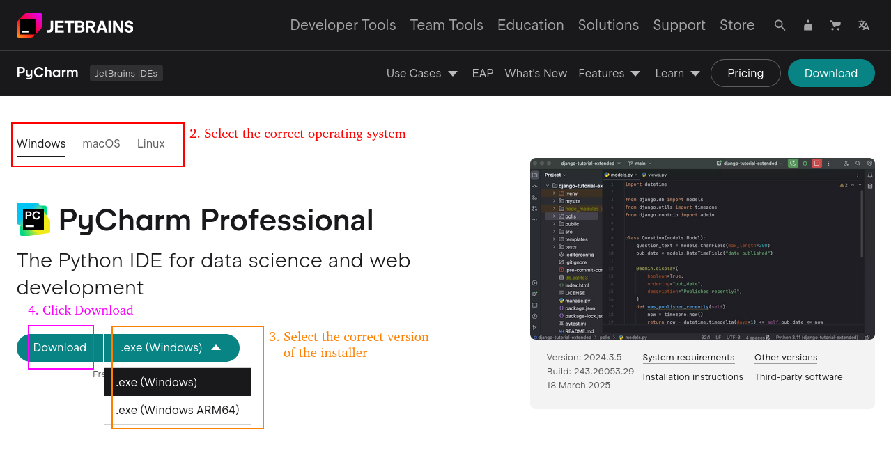

# Installing PyCharm

For COMP1510, we will install PyCharm Professional, not PyCharm Community, in order to have the most poweful version of the IDE with the most features. 

1. Go to [this link](https://www.jetbrains.com/pycharm/download/) on the computer you want to install PyCharm to.

2. PyCharm Professional supports Windows, Mac, and Linux, and the website should automatically detect your operating system. If it is incorrect, click on the correct one from the choices just below the header.

3. The website should also automatically detect the architecture of your computer and select the correct version of the installer, but if it is incorrect, click the dropdown beside the `Download` button and select the correct version.

4. Click the `Download` button to download the installer.

5. Go to the folder where the file was downloaded to and click on it to begin installation. It's a large file so it's normal for it to take a few seconds to load.
