# Installing Python and PyCharm

Python is the programming language while PyCharm is the IDE that helps you write code in that language. They are created by separate organizations, and need to be installed separately. Here, we will first install Python and then PyCharm.

The screenshots in this document will show the installers for Windows, but it should be very similar on Mac.

## Installing Python

You should only have to do this on Windows and Mac. Most Linux distributions should already come with an up to date Python interpreter, but Windows doesn't have one by default and Mac has an outdated version.

1. Go to [this link](https://www.python.org/downloads/) on the computer you want to install Python to.

2. The website should automatically detect your operating system and change the main download button to the correct version of the installer. If the auto detection is not correct, click one of the options below to manually select the version.
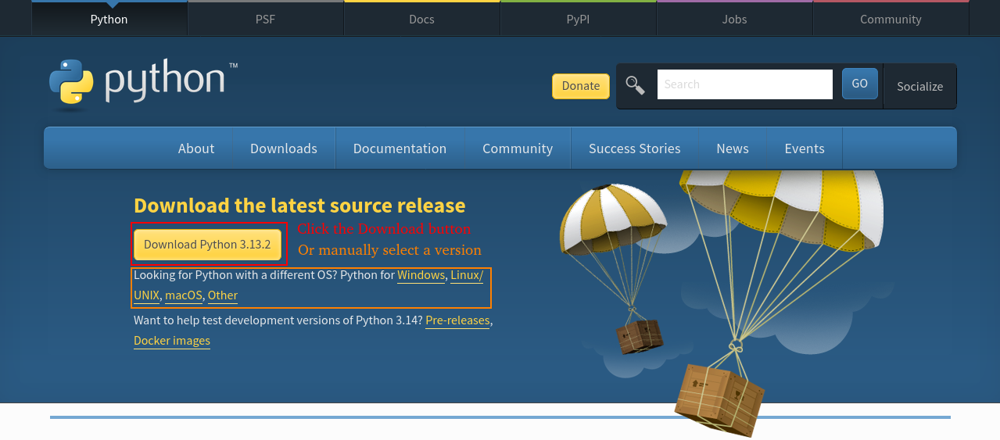

3. Go to the folder where the file was downloaded to and click on it to begin installation.

4. Check the box labelled `Add python to PATH`, to make Python more easily accessible on your terminal, and then click `Install Now`.
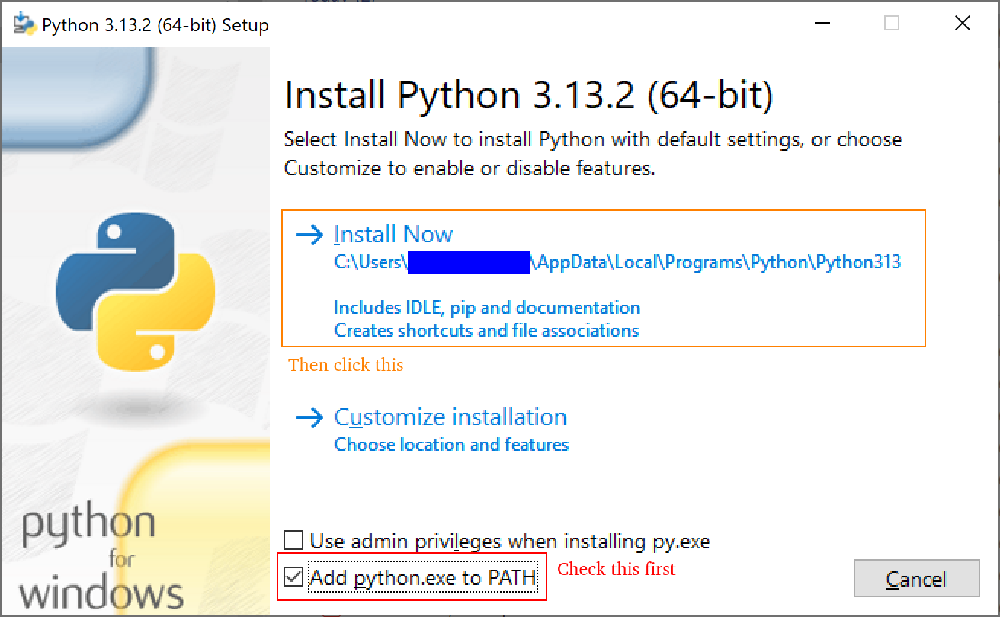

5. Wait for the installer to finish.
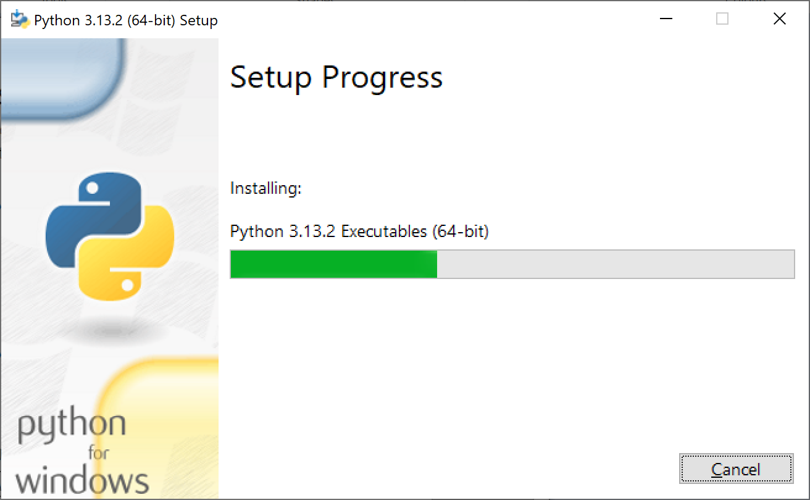

6. Click `Close` when the installation is complete.
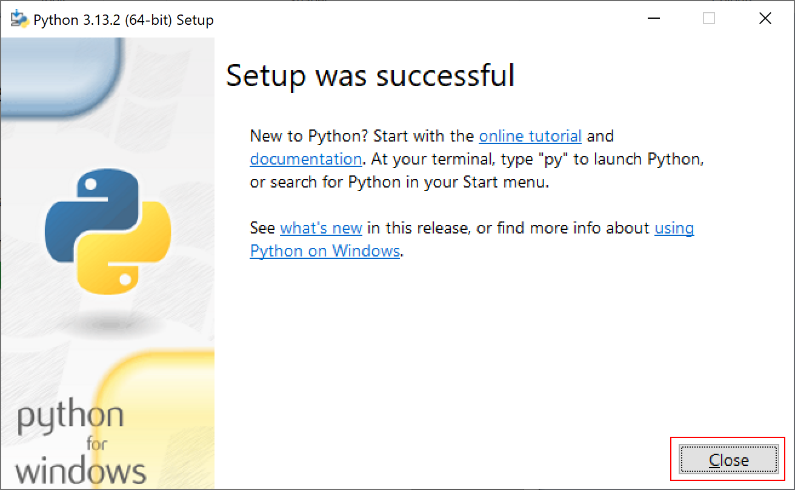

## Installing PyCharm

For COMP1510, we will install PyCharm Professional, not PyCharm Community, in order to have the most poweful version of the IDE with the most features. 

1. Go to [this link](https://www.jetbrains.com/pycharm/download/) on the computer you want to install PyCharm to.

2. PyCharm Professional supports Windows, Mac, and Linux, and the website should automatically detect your operating system. If it is incorrect, click on the correct one from the choices just below the header.

3. The website should also automatically detect the architecture of your computer and select the correct version of the installer, but if it is incorrect, click the dropdown beside the `Download` button and select the correct version.

4. Click the `Download` button to download the installer.

5. Go to the folder where the file was downloaded to and click on it to begin installation. It's a large file so it's normal for it to take a few seconds to load.

6. Click next for the next two screens.
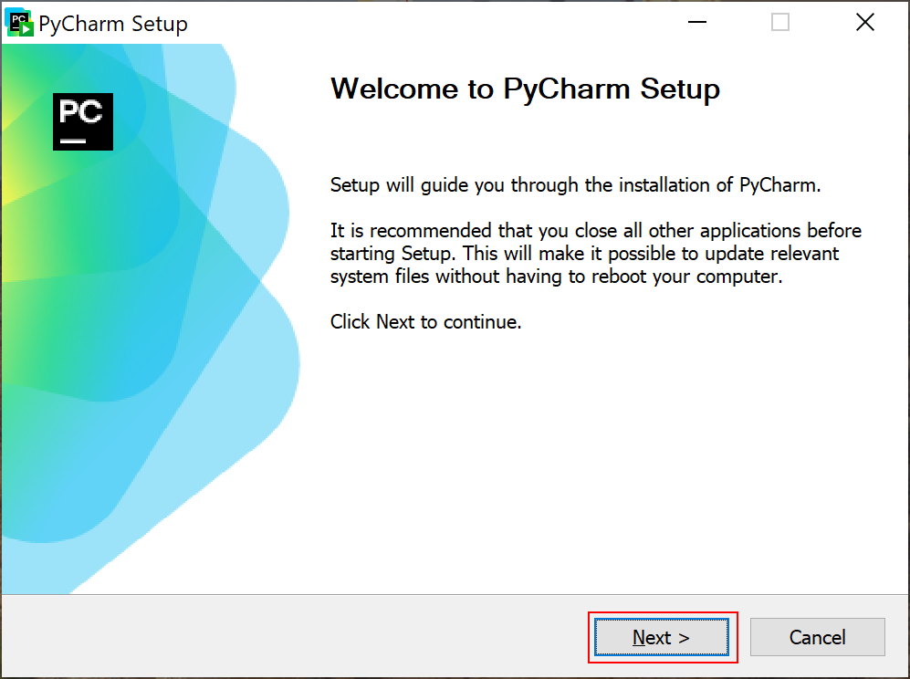
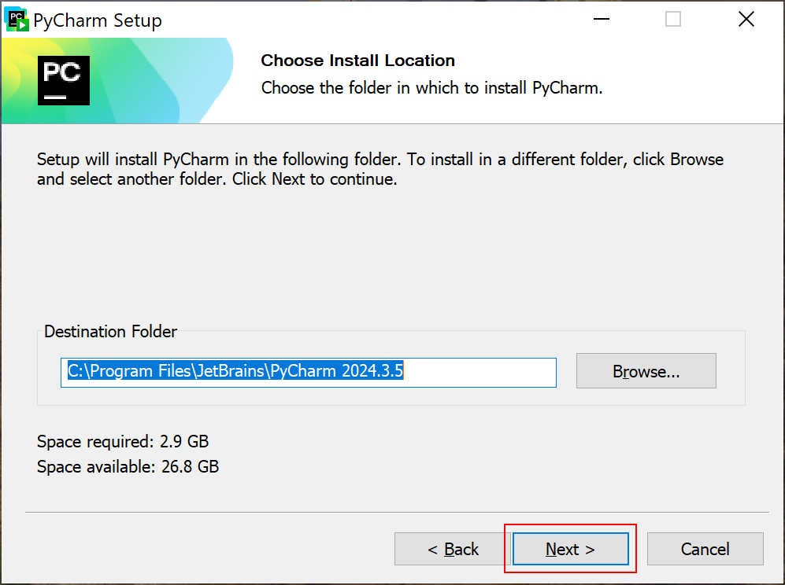

7. It is recommended to check the boxes for `Open folder as project` and `Associate .py files`, as these will allow for quicker access to PyCharm. Then click next.
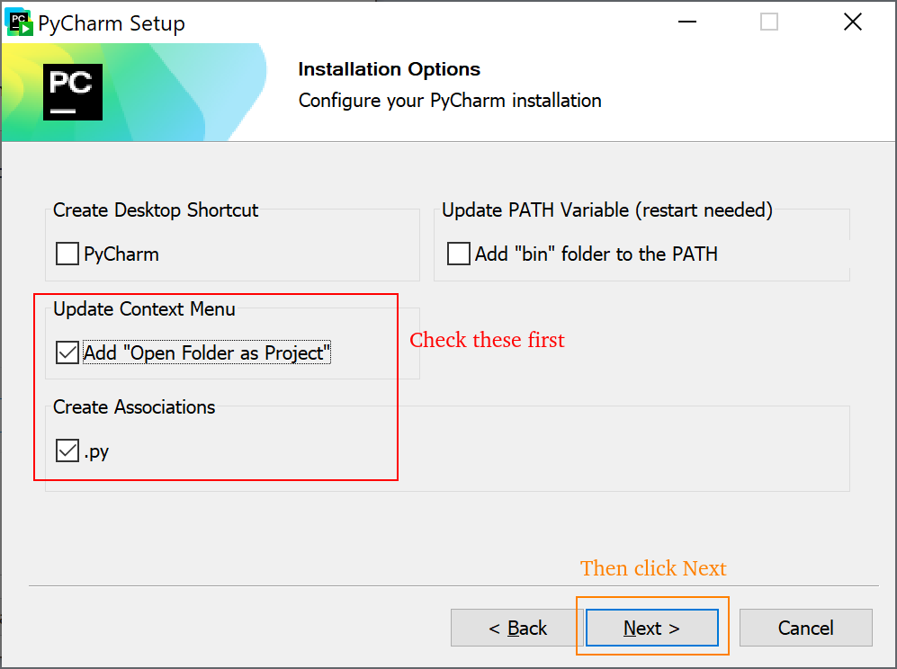

8. Click install.
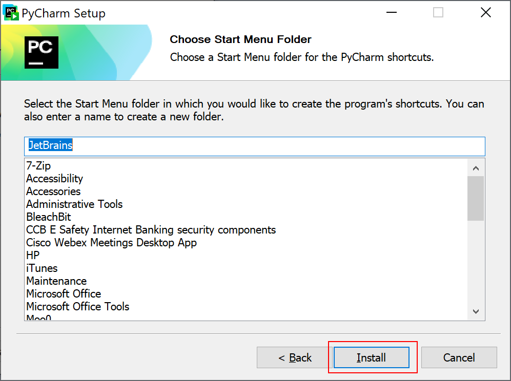

9. Wait for the installation to complete.
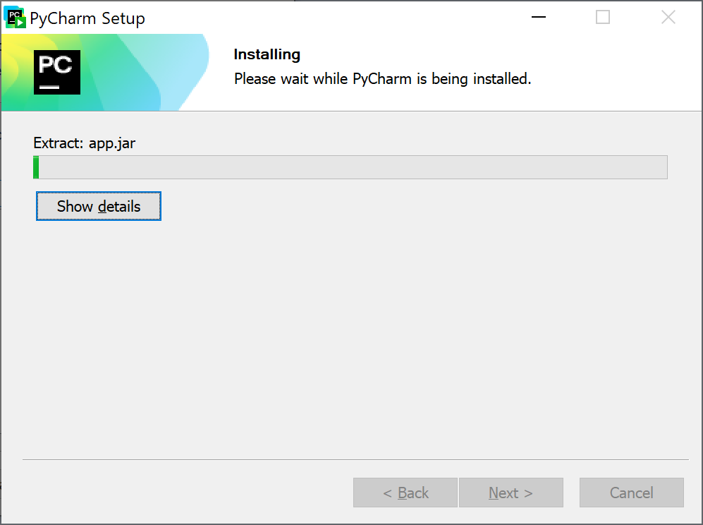

10. Check the box labelled `Run PyCharm` and then click `Finish`. The newly installed PyCharm will open.
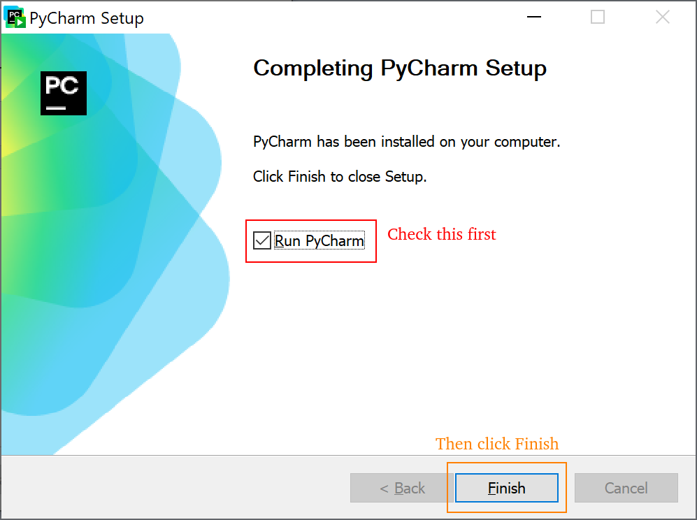

11. Check the box for agreeing to the user agreement and click `Continue`
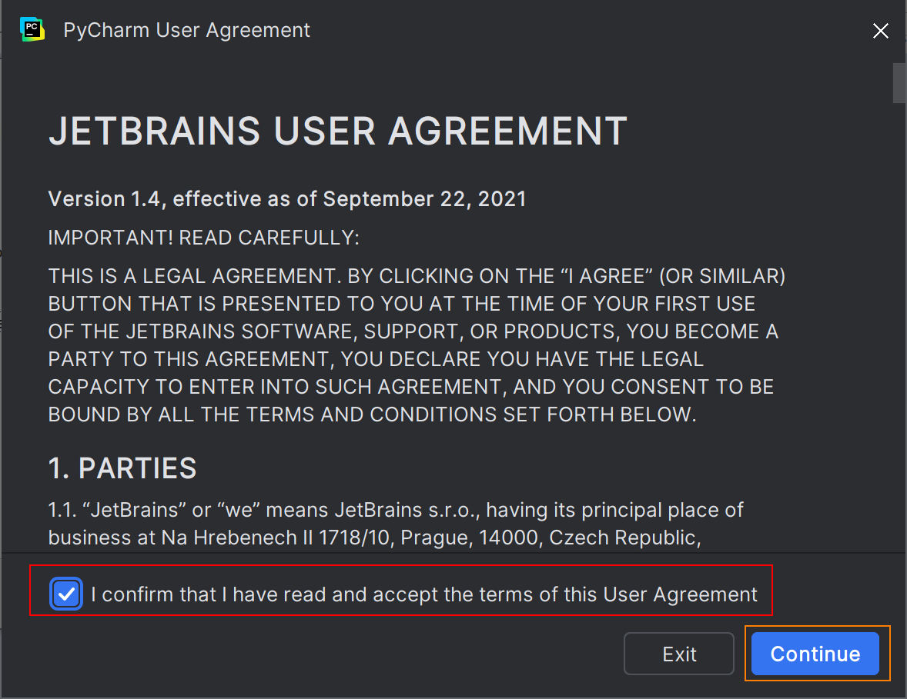

12. Choose whether to send usage statistics to Intellij.
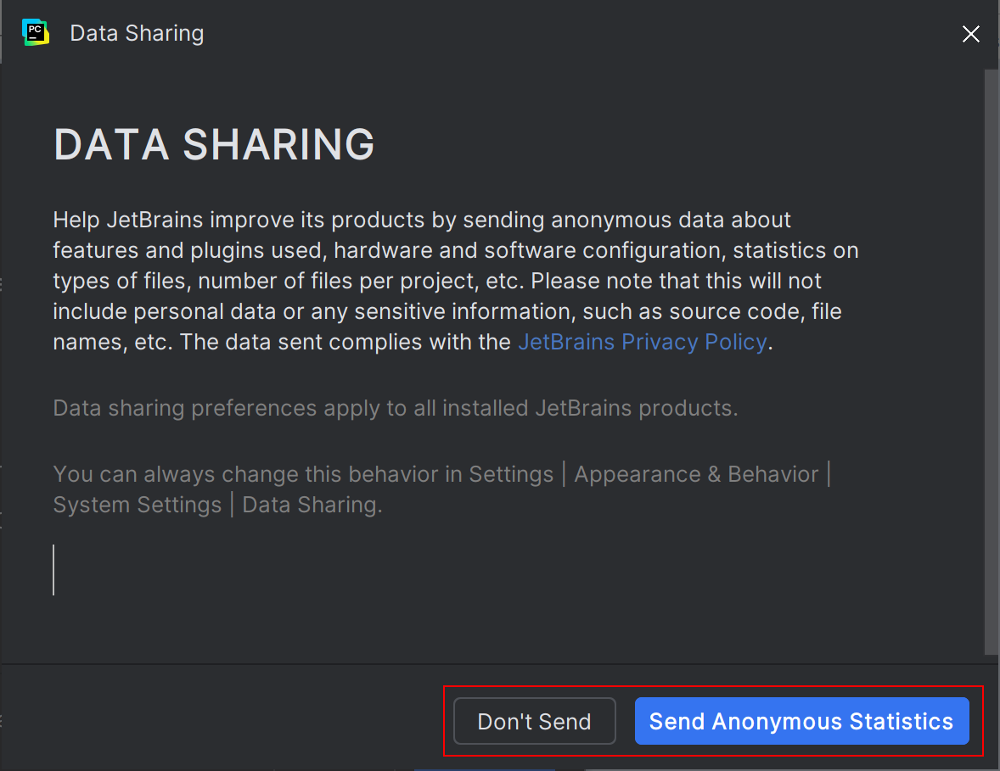

13. Click `Free 30-Day Trial` for now, we will activate the license in the Configuration section.
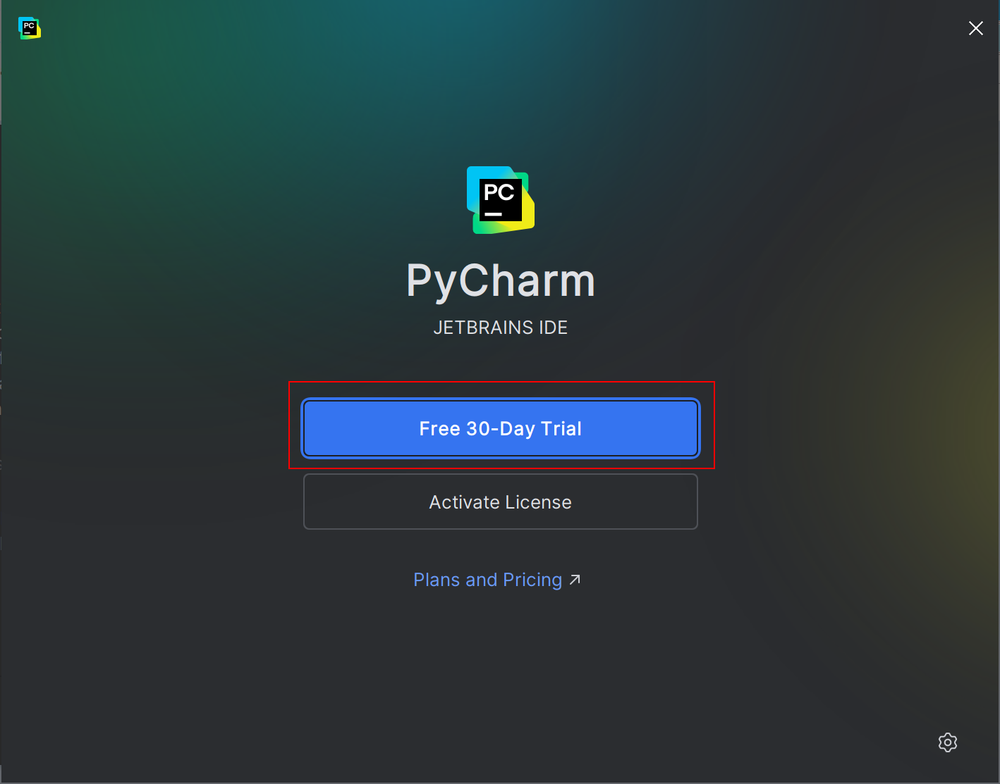

14. If the installation was successful, you should see this landing screen:
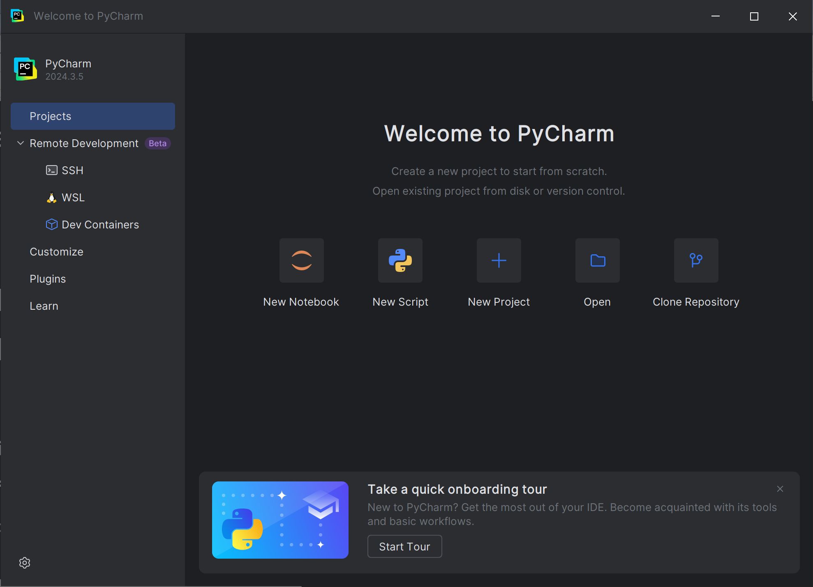
